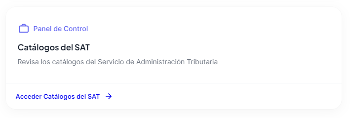
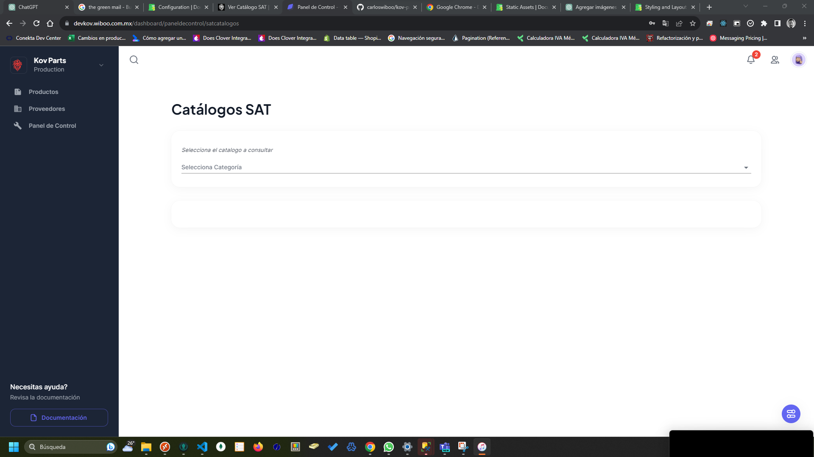
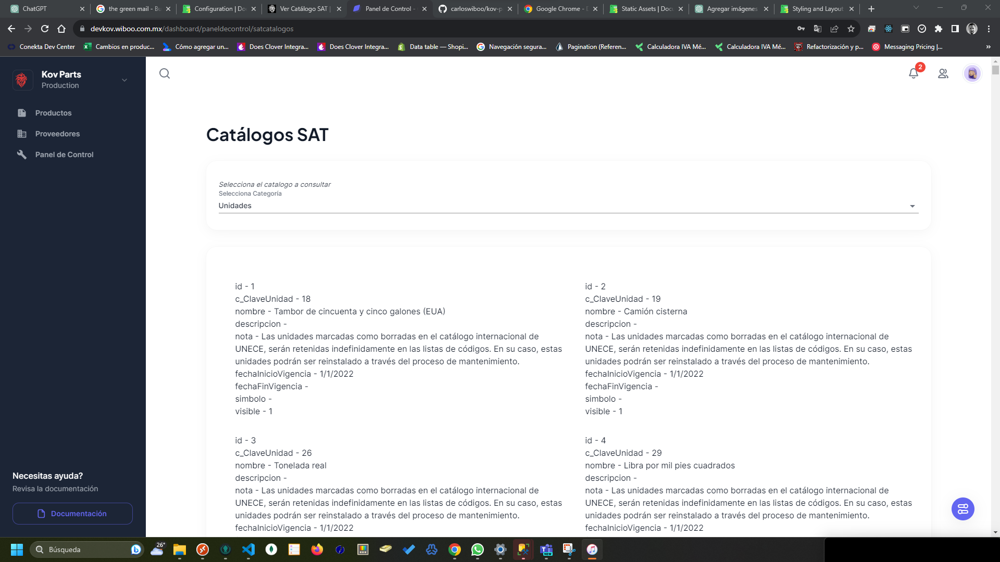

# Ver Catálogo SAT

Puedes revisar los catálogos del SAT accediendo al **panel de control**, y posteriormente seleccionado la opción catálogos SAT como se muestra a continuación:

Verás una vista como la siguiente, lo que deberás hacer es seleccionar la categoría que deseas consultar.

Al seleccionar la opción deseada verás la información, aquí te mostramos un ejemplo.

:::danger Información del catálogo

Estos catálogos solo vienen en modo de **solo lectura**, por lo cual si deseas agregar algo deberás primero revisar si es válido con la legislación actual, y si es válida comunicarla al departamento de desarrollo para hacer los cambios.

:::
