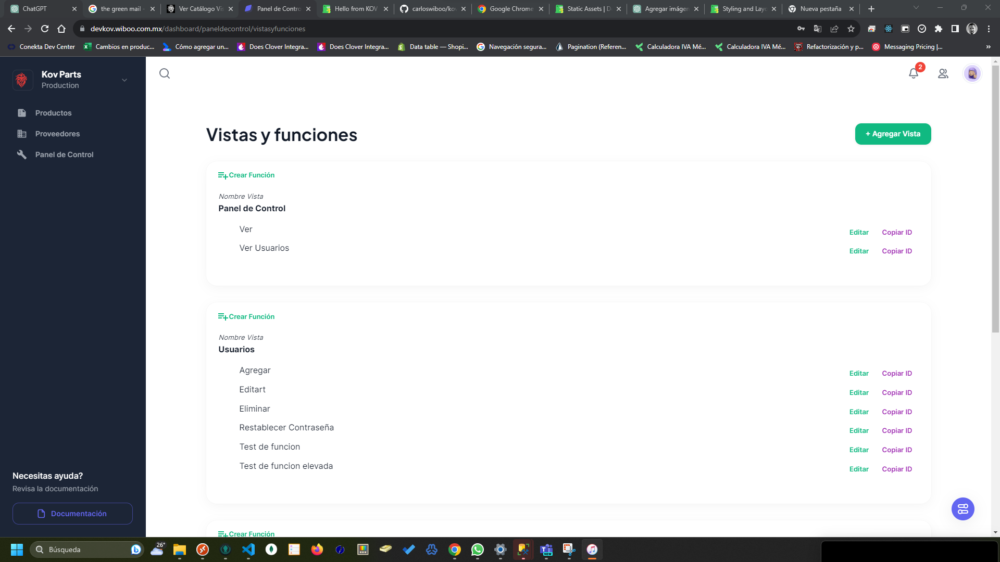

# Ver Catálogo Vistas y Funciones

:::danger Información del catálogo

Este catálogo será utilizado para fines de programación, cuando se necesite una vista nueva, lo que haremos será agregar en este catálogo, y sus funciones de igual manera, lo que hará que podamos asignar permisos y funciones a los usuarios del sistema.

:::

Puedes revisar los catálogos del Vistas y funciones deberás acceder al **panel de control**, y posteriormente seleccionado la opción **Catálogo de vistas y funciones** como se muestra a continuación:

