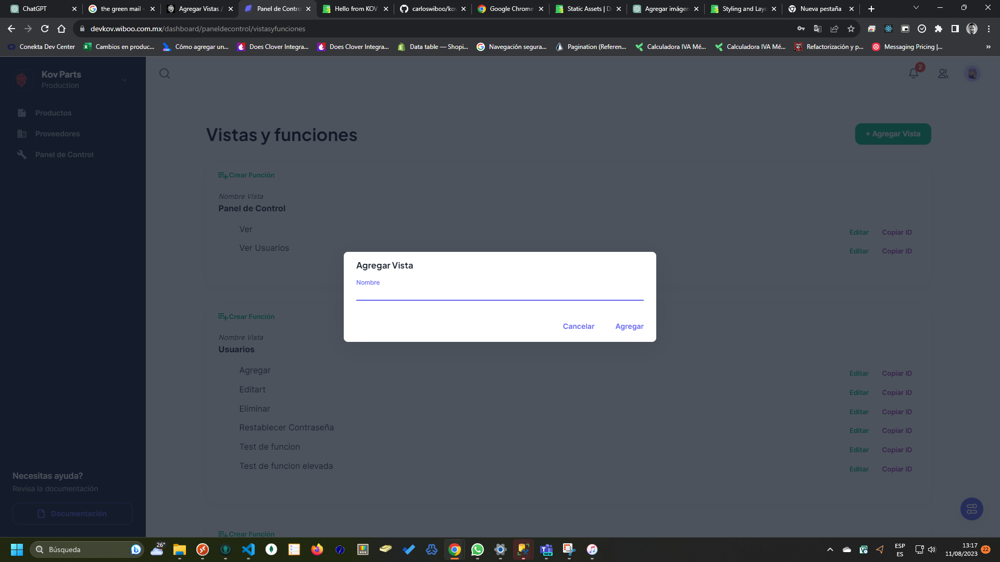

# Agregar Vista

:::danger Información del catálogo

Este catálogo será utilizado para fines de programación, cuando se necesite una vista nueva, lo que haremos será agregar en este catálogo, y sus funciones de igual manera, lo que hará que podamos asignar permisos y funciones a los usuarios del sistema.

:::

Para agregar una vista deberás presionar el botón **+ Agregar Vista**, que se encuentra en la parter superior de la pantalla de Vistas y Funciones.

Una vez presionado deberás agregar la información solicitada, y una vez llenada pulsar el botón de **Agregar**

