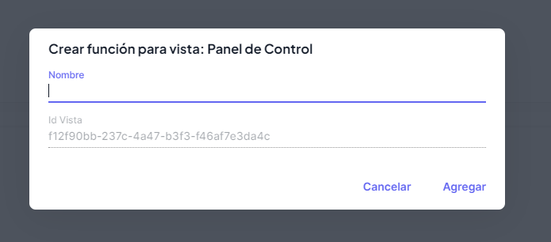

# Agregar Función

:::danger Información del catálogo

Este catálogo será utilizado para fines de programación, cuando se necesite una vista nueva, lo que haremos será agregar en este catálogo, y sus funciones de igual manera, lo que hará que podamos asignar permisos y funciones a los usuarios del sistema.

:::

Para agregar una función deberás presionar el botón **+ Crear Función**, que se encuentra en cada vista como se muestra a continuación.

Una vez presionado deberás agregar la información solicitada, y una vez llenada pulsar el botón de **Agregar**

