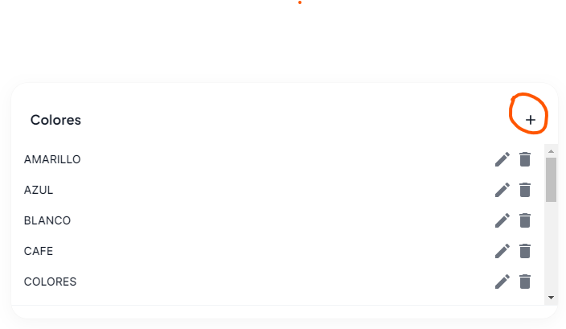
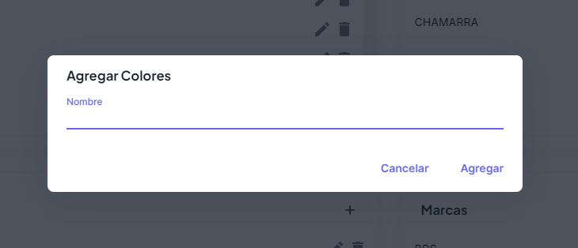

# Agregar a categoría

Para agregar un dato a una categoría, deberás presionar el botón **+**, que se encuentra dentro de cada categoría, en este ejemplo agregaremos un color nuevo.

Una vez presionado deberás agregar la información solicitada, y una vez llenada pulsar el botón de **Agregar**

### Listo!

Ya haz agregado el color nuevo, puedes probar con diferentes combinaciones y tipos.
