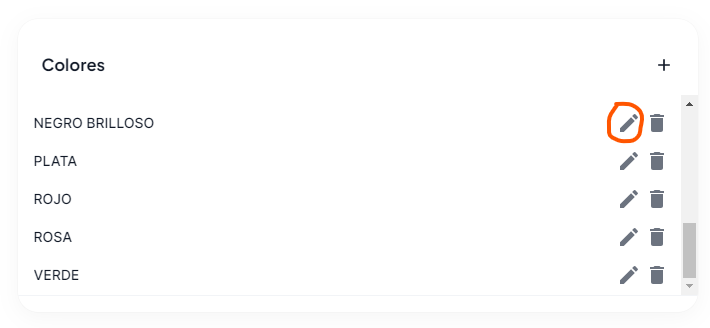
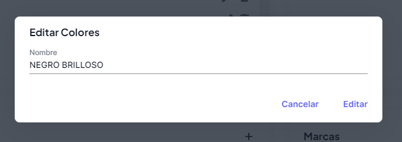

# Editar dato de categoría

Para editar un dato a una categoría, deberás presionar el botón **edición**, que se encuentra dentro de cada categoría, en este ejemplo editaremos un color.

Una vez presionado deberás agregar la información solicitada, y una vez llenada pulsar el botón de **Editar**

### Listo!

Ya haz editado el color, puedes probar con diferentes combinaciones y tipos.
