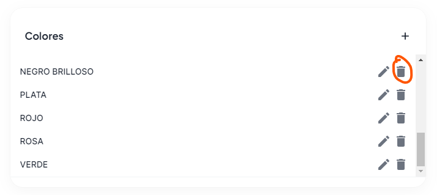
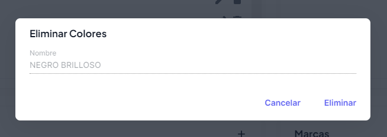

# Eliminar dato de categoría

Para eliminar un dato a una categoría, deberás presionar el botón **eliminar**, que se encuentra dentro de cada categoría, en este ejemplo eliminaremos un color.

Una vez presionado deberás agregar la información solicitada, y una vez llenada pulsar el botón de **Eliminar**

### Listo!

Ya haz eliminado el color, puedes probar con diferentes combinaciones y tipos.

:::danger Información del catálogo

Estos catálogos solo vienen en modo de **solo lectura**, por lo cual si deseas agregar algo deberás primero revisar si es válido con la legislación actual, y si es válida comunicarla al departamento de desarrollo para hacer los cambios.

Recuerda que al eliminar un dato perderás todas las relaciones que tengas actuales con los productos, por lo cual sugerimos evitar el uso de este botón de eliminación, si tienes más dudas no dudes en comunicarte con nosotros.

:::
