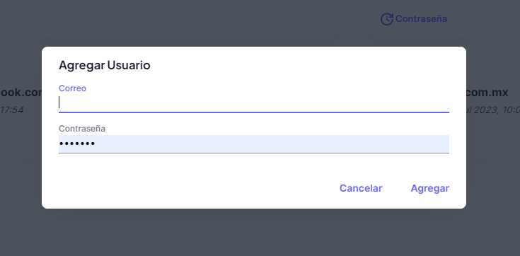

# Crear Usuarios

Para poder crear usuarios al sistema, deberás seleccionar el botón **+ Agregar Usuario**, que se encuentra en la parte superior derecha de la pantalla en color verde, después deberás agregar la información del usuario como aparece en la siguiente pantalla.

No olvides pulsar el botón agregar.

Una vez que agregues el usuario enviaremos un correo electrónico al usuario para que pueda activar la cuenta.

Recuerda que una vez agregado el usuario, este tiene **10 minutos** para realizar la activación de su cuenta, de lo contrario deberás realizar el cambio de la contraseña para volver a activar dicho usuario.
