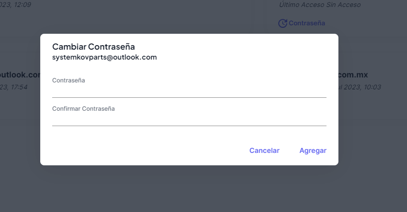

# Cambiar Contraseña

Para poder cambiar la contraseña de los usuarios al sistema, deberás seleccionar el botón **contraseña**, que aparece en cada tarjeta de usuario como se muestra a continuación:

Deberás ingresar la contraseña y confirmar. **No olvides pulsar el botón agregar**.

Una vez cambiada la contraseña, mandaremos un correo informando del cambio al usuario.
