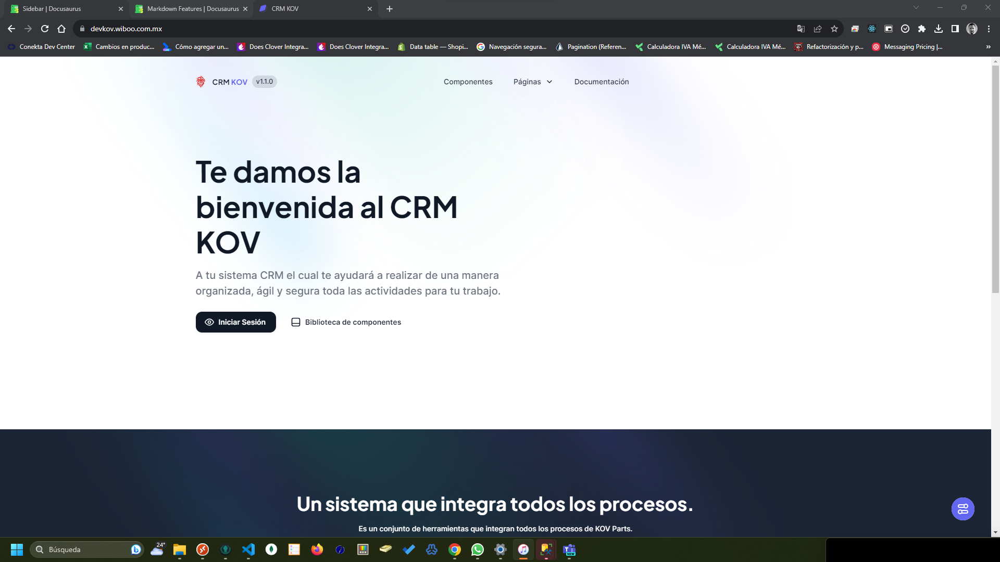
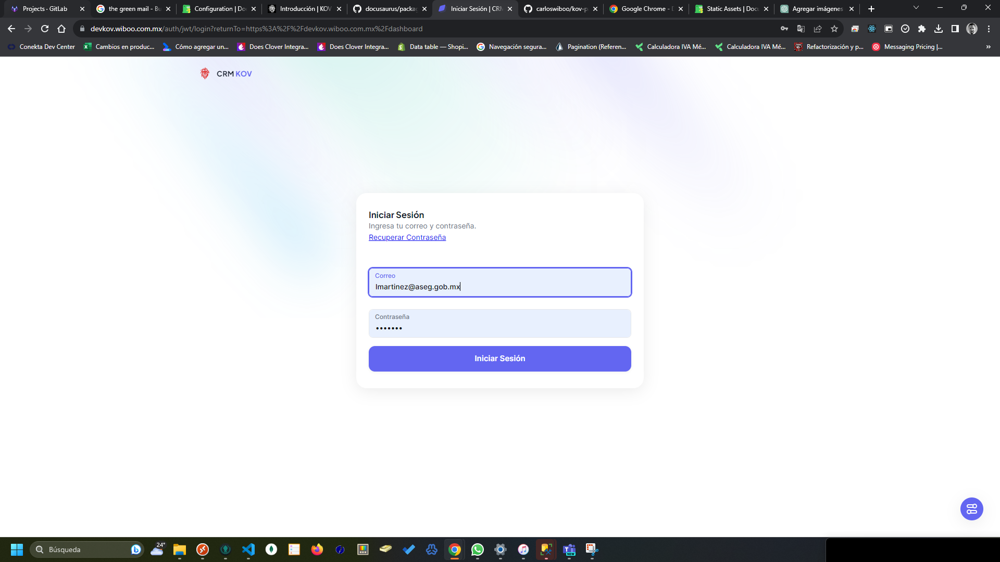
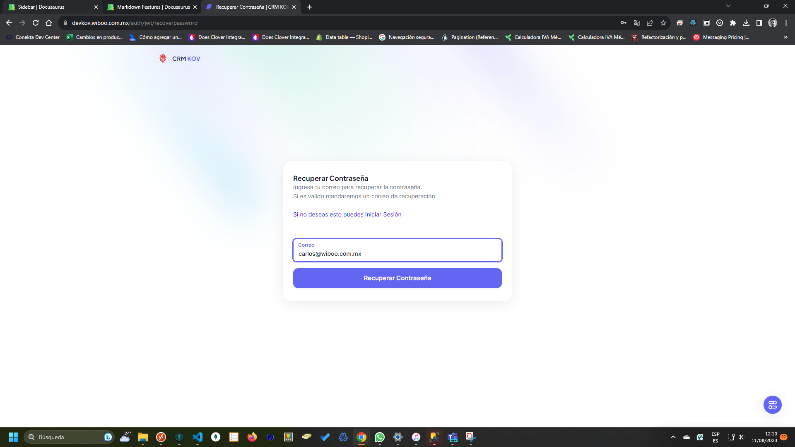

# Introducción

Aprende a utilizar el sistema CRM KOV Parts **en menos de 5 minutos**.

## Comenzando

Accediendo a la página **[de Inicio de sesión](https://devkov.wiboo.com.mx/)**.

### ¿Qué necesitas para que el sistema funcione?

- [Google Chrome](https://www.google.com/chrome/dr/download/?brand=JJTC&gclid=Cj0KCQjwuNemBhCBARIsADp74QTTxca0um2REXH5Eov3df1FTXPn1IRFe3q0ae2YrP5pdhK7BmvbBXEaAvmQEALw_wcB&gclsrc=aw.ds) En su versión más actualizada. Puedes utilizar cualquier otro navegador, sin embargo recomendamos **Google Chrome** debido a su amplia compatibilidad web.

## Página de inicio / Inicio de sesión

### Activar cuenta

Si eres un usuario nuevo, tu administrador deberá crear tu cuenta en el sistema, una vez realizada la creación llegará un correo electrónico en el cual deberás abrirlo y pulsar click para activarlo, la liga que llega por correo tiene un vencimiento de activación de 10 minutos, esto quiere decir que si pasan esos 10 minutos ya no podrás activar la cuenta y deberás solicitar que se haga el envío de la activación nuevamente.

### Ingresando Usuario Contraseña

Para iniciar sesión deberás pulsar el botón iniciar sesión, posteriormente ingresar tu **usuario y contraseña**.

Recuerda que el usuario será el correo electrónico que hayan dado de alta y la contraseña deberá tener por lo menos 8 caracteres, **recuerda que una contraseña segura ayuda a tener una integridad en el sistema**.

### Restablecer Contraseña

Si la respuesta es erronea, puedes solicitar el restablecimiento de la contraseña pulsando el botón **Recuperar Contraseña**, donde solicitaremos tu correo electrónico, una vez puesto, enviaremos un enlace para que puedas generar el cambio de tu contraseña.

Si aún así sigues teniendo problemas para acceder, te invitamos a ponerte en contacto con tu administrador para que restablezca la contraseña desde el sistema.
